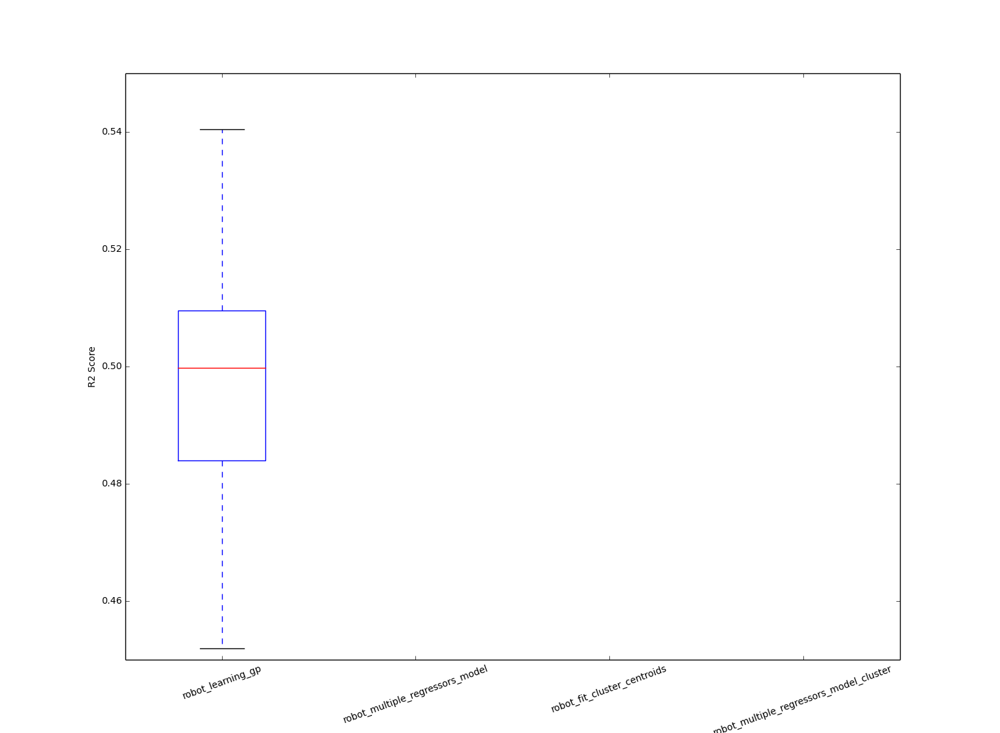

Internship Report - Part 2

# Table of contents

[[TOC]]

# General diagram for the internship

# 

# EXP-1: What is the optimal pareto front for the 12-D controller?

In this minor experiment, that target was to know the optimal PF, for the sake of comparison, and also in order to use these points for other experiments.

Here, I used NSGA-2 with 200 population for 1081 generations.

The result can be found in the following image (NOTE:  To get the data set of the actual pareto front points, see this link https://drive.google.com/folderview?id=0Bwut9uD_4aJ-fmZ6YzVRMmJsel9GbjVHeExmUUxJN0pHOFA1elpNNjFvZXdiZlJfTzhSVlU&usp=sharing).

The size of this PF hyper volume is 2.12, using a ref point of (2,2).

# EXP0: Reduce the robot controller dimensionality to 6-D instead of 12-D

In this experiment, I tried the algorithms on a 6-D controller (the first joint in each leg).

The initialization of the GP (NOTE:  Unless specifically said, I usually use the default parameters for a GP in the scikit library, which is GaussianProcess(corr='squared_exponential', theta0=1e-2, thetaL=1e-4, thetaU=1e-1, random_start=100), with nugget between 3.00e-13 and 3.00e-15. Also, for the GP mean, I use the default mean of zero (which require that you shift the data to center on zero by subtracting the mean of the data).) for EHVI and PAREGO is done with 30 points only (I will try to repeat the experiment with higher number of points).

The experiment shows that again unexpected results, with EHVI not performing up to expectations.

Possible issues:

* It could be due to the GP initialization low budget.

* However, this is still a fair comparison between the algorithms.

# EXP1: Does the GP learn anything with our current sampling budget?

This is an important question, after the failure of the optimization experiment on the 6-D robot controller. 

The experiment is made on different number of training samples for the GP. Each experiment is repeated 50 times to perform statistics.

I made the same test on benchmark problem, ZDT1, and on different robot controllers.

## On the benchmark problem

Here I was trying to learn the 2nd objective in ZDT1 problem (since the 1st objective equals to the first input dimension) (NOTE:  Review this link http://www.tik.ee.ethz.ch/sop/download/supplementary/testproblems/zdt1/index.php). 

I tested on all the dimensions from 2-12.

Here I present the results for the 2-D controller and 12-D controller (NOTE:  For the rest of the results, and the corresponding statistics, see https://drive.google.com/folderview?id=0Bwut9uD_4aJ-fnFtRGtPS0RTeEdkQkoxS0Z4MDM1U3oyaE9PTFNmSHZjTmUwZnpERVdlaTA&usp=sharing).

Conclusions:

* The problem is very easy to learn. With almost 20 points, you can get a high quality model at 12 dimensions.

* This explains EHVI superior performance on the  benchmark problem.

## On the robot controller

The dimensions tested are : 1,2,3,4,5,6 and 12. The dimensions of the controller correspond the number of joints it controls. For example, 2-D controller 2 joints in the first leg of the robot only, with all other joints parameters being fixed.

The objective here is to learn the robot speed.

The results for the 2-D and 6-D controller can be shown in the following images (NOTE:  The rest of the results can be seen in https://drive.google.com/folderview?id=0Bwut9uD_4aJ-flo4MENFczdIN24yQl9Ob1NHTlF5Y0NNZnBSWkRpaVNmZFZQY2RiSGFSTVk&usp=sharing).

I also tested with another 6-D controller (which control exactly one joint in each leg). This is the controller I tested before in the optimization. 

Conclusions:

* In previous experiment with the 6-D controller, we expected it to work. This experiment shows that there was no way it would have worked. The model quality for different number sampling points is bad. So, the results from the previous experiment with EHVI and this experiment are consistent (in the optimization experiment, I initialized the GP with 30 points, and the experiment run for 100 evaluations).

Notes:

* Some of the adjusted R2 scores are in negative. I tried to search for a meaning for negative results. The common opinion I found is that it is safe to assume any negative results to be zero.

* I made some experiments with the GP noise (the nuggets), but with no clear advantage at any point.

Questions I don’t have answer for:

* If you see the trend from 1D to 6D, and then look at 12D, you find that the models seems to perform better on 12D (even though they are still bad). It’s not clear for me why this happens, taken into account that I use the same parameters for GP for all the tests.

# EXP2: Confirm the results of EXP1 on the optimization experiment.

In this experiment, I run EHVI, ParEgo and NSGA-2 on a 2-D robot controller. The idea is to confirm if action 1 results are consistent with what we see in the optimization experiment. 

Based on action 1 results for the 2-D controller - not a useful, but for the sake of comparison only) just controlling two joints in one of the robot legs), the setup I use for action 2 is:

* GP AUTO

* GP initialized with 250 points (for both EHVI and ParEgo).

* 2-D robot controller: Here, I just control two joints of one leg. All other joints are fixed.

The results are in the following image.

Conclusions:

* This experiment is very consistent with action 1 results. EHVI (and even ParEgo) perform significantly better than NSGA-2. EHVI is better than ParEgo as well.

My ideas for action 1 and action 2:

* I think it is safe to assume now the GP for the current setup will not work properly alone.

* For the future, it could be interesting to:

    * Repeat action 1 with new robot controllers (since the current controller seems sensitive to any small change in parameters).

    * Repeat action 1 with LHS sampling. I choose uniform sampling because I can just make databases of points and sample from. For LHS, I "believe" I may need to sample from the robot directly - I am not sure -, which will make the experiment takes longer.

Quick note:

* This experiment - for ParEgo and EHVI only - took, on Serena's machine, 47 hours!

# EXP3: Make a comparison between LHS and uniform sampling.

I made this comparison to establish whether LHS will be useful for us or not.

I made a test on the 12-D controller.  The number of training data points is 200 points. The experiment has been repeated 40 times for the statistics.

Conclusions:

* Identical results between uniform sampling and LHS.

* This suggest that, with this small number of training points, there is still high sparsity. It didn’t matter that much after all.

Suggestions:

* I highly suggest trying to make a comparison between EHVI with LHS and without it. I’m still under the doubt that this just measuring the model predictability may not the best way to make a decision about the model. Such an experiment will confirm this doubt or reject it.

# EXP4: Test different mixes of Gaussian Process.

In this case, I use some techniques mentioned in "Computational Intelligence in Expensive Optimization Problems" book, and another paper given to me by a postdoc colleague in the lab:

* Sparsification techniques for the gaussian process

    * Technique 1: Divide the data between multiple small gaussian processes randomly.

    * Technique 2: Cluster the input data, and fit a local GP for each cluster.

* Smarter way to chose points for the gaussian process

    * Cluster the data. Use the centroids of the clusters as the training data points for the gaussian process.

I compare these three techniques with the original system I use (fitting GP with just random points). 

I did several experiments on this. This following images is for results on the 12-D controller.

Words used:

* robot_learning_gp: This is a normal GP fitted with random points.

* robot_multiple_regressors_model: This is just fitting smaller GPs with parts of data. For example, if we have 300 points, and 3 GPs, we randomly choose 100 points for each GP (no overlapping points).

* robot_multiple_regressors_model_cluster: In this case, I cluster the data points I have into N clusters, and I fit N GPs, one for each cluster (local regressors).

* robot_fit_cluster_centroids: In this case, I cluster the data points I have into N clusters. I use the centroids to fit the gaussian process.

Why to sparsify the GP?

* The idea is to reduce the computational complexity of fitting one GP by the whole data.

* One of the techniques is to fit smaller regressors with parts of data. The smaller regressors can be local regressors (based on clustering)

* Although results reported aren’t brilliant, it is mainly to establish a comparison between the quality of each model.

The setup for the experiment:

* Each model has a budget of 300 points.

* In case of using local regressors, I use 3 local regressors, each with a budget of nearly 100 points.

Conclusions:

* It seems that a better choice of data points (the centroids of the clusters) result in a much better GP.

* Fitting local regressors to clusters (robot_multiple_regressors_model_cluster) seems to be promising. It also scales nicely (with larger training data sets). On the other hand, the ideal number of clusters is an issue to be studied.

Notes:

* I didn’t try these models on the optimization experiment.

# EXP5: Concerning DT-GP model

In order to overcome the limits of using GP alone (the high complexity when the number of samples increases), a new model is suggested. Using SVM or DT, we can learn a very good model for the robot speed. In the same time, we wish to get some to get the advantage of GP of giving us the variance (the belief) about each predicted point.

The idea is:

* Learn DT on the good robot with as many samples needed.

* On the damaged robot:

    * Sample a random 200

On the **2-D robot controller**, in this experiment, I do the following:

* From the good robot:

    * Learn a Decision Tree model on the good robot (15000 points).

    * Sample 1000 random points from the good robot, and score them with the following mode

* On the damaged robot:

    * Predict 200 points from the damaged robot using the previous DT.

    * Learn a GP for the difference between the prediction of these 200 points and their actual values.

* Final test

    * Sample 1000 random points from the damaged robot, and calculate the R2 score for the following model

        * DT prediction from the good robot + GP that learnt the difference between DT prediction and the actual values for the damaged robot.

The results are can be shown in the following figure.

Note: Ignore the first item in the X-axis.

The results seems good. The use of the GP model seems to have enhanced our DT model for the damaged robot.

Now, doing the same experiment again for **6-D robot controller**, we get the following results

The DT model performs near perfection in the good robot. When trying it on the damaged robot, it performs very poorly. Using the DT prediction on the damaged robot to make training data for the GP make the problem even worse. 

In short, the idea of mixing DT from the good robot and GP that model the different between that DT prediction  and the actual values on the damaged robot doesn’t work.

Conclusions:

* DT-GP idea worked in 2-D controller, but not in 6-D controller.

    * The DT model for undamaged 2-D robot controller performed well on the damaged robot. However this was not the case for the 6-D controller.

* The unexpected outcome from this experiment is that it shows us that even if we solved the GP issues (using sparsification or whatever technique), this will not be of help for the damage recovery if we are searching in the "native (NOTE:  By native solution space, I mean the solution space that have the joints parameters as inputs. An “Elite" search space, like the one used in the nature paper, is where each position in the solution space is the very best solution of its kind for a specific behavioral descriptor.)” solution space. This gives more confident in the idea of MAP-ELITE (Even though it may be tricky to apply it for multi-objective optimization).

# EXP 6: Does the GP performs well on the repertoire?

Following the previous line of question, the next logical question is: How did the GP performed in the nature paper? I expect it had performed really nice!

Although I didn’t use the same GP parameters in the paper, this was a quick experiment to get some insight. 

Experiment details:

* GP learns 20 random points only from the repertoire.

* Then its R2 score is calculated for 1000 test points (from the repertoire).

* These two steps are are repeated 100 times to get the statistics.

The results can be shown in the following image.

Notice that the input of the repertoire is a 6-D behavioural descriptor. 

Conclusions:

* The model seems OK in quality (but not the best).

* A possible conclusion for high such model quality are working in single objective optimization, but may not in multiobjective optimization, is that if you’ve two low quality models, and you need to select the next point of expected improvement, the situation is much worse than using a single low quality model. You need more points in order to be able to have good results (NOTE:  There is no clear definition for regression models for what is "good" or “bad” models with the R2 score estimation. A clear study needs to be made about explicit relation between the model quality and optimization results. Here, It was noticed that if that model has an R2 score of > 0.2, then it gives good results in optimization. Again, it is an implicit notice point.).

# EXP 7: Explore meaningful 2-D robot control for future experiment.

Since 12-D and 6-D optimization experiment didn’t show any good outcome, so I decided to explore simpler (and still meaningful (NOTE:  In all the previous experiments, the 2-D robot controller is just controlling 2 joints in the 1st leg of the robot. It is meant for test the algorithms scalability, but not as a final controller.)) robot controllers.

* CONTROLLER 0: 2-D is achieved by controlling 2 joints from one of the six legs only (not a useful controller, but for the sake of comparison).
In this case, the objective functions look very nice (for the robot speed and for the height variance).


* CONTROLLER 1: 2-D is achieved by controlling the amplitude and the phase shift between each two consecutive legs ( a global phase shi200ft).
In this case, the functions have non-linearity and discontinuities.


* CONTROLLER 2: 2-D is achieved by controlling the amplitude and the phase shift between each two 2 joints in the same leg.
In this case, the functions have even much high non-linearity and discontinuities.



To draw these graphs, a 1000 samples from each controller are used.

CONTROLLER 1 - even though the high non linearity in the 2nd objective - may work well. I tried to learn both objectives with a GP. It’s R2 score is around 0.5 with 200 points being used.

The R2 score for the robot speed on the left, and for the robot variance on the right.

Below are the results from learning a GP on the good model, and then using it for the prediction of a two different kinds of a damaged robot.

(I should have tested on controller V1 instead of V2) - The result for the 2-D V2 controller in optimization (GP initialized with 200 points, and the test is run for 100 evaluations) is shown in the following image.

These results are consistent with the model quality I obtained earlier. (NOTE:  There are two reasons why we didn’t push in this experiment. 
EXP 5 shows that even if I have a good model, this soon will collapse in the case robot damage. This happens in some cases for the 2-D controller (depending on the type of damage).
Having a 2-D controller for a hexapod is not an interesting thing to show. Also, even we somehow (patch) the algorithms together, there is no way this patching will be of any use of any slightly higher dimension problem.)

Encouraged by these results, I tried - for this controller - to move on the robot damage recovery. The idea is to use random points from the good robot to initialize a GP that will be then used for optimization on the damaged robot. 

I tested with two types of damage:

* DamageOne: I remove the rear leg in the right side.

* DamageTwo: I remove the middle leg in the right side

* DamageThree(planned, but I didn’t execute): Remove the front leg of the robot in the right side.

The algorithms I compared are:

* NSGA-2

* EHVI with no priors at all

* EHVI with priors from the good robot.

The results can be shown in the following images:

The first damage shows that the prior give a good advantage to the robot. The 2nd damage however, shows that no significant advantage was made from priors. These are the stats for the 2nd damage

ehvinoprior  VS  nsga2  --> (66.0, 0.24320097107575667)

ehvinoprior  median =  2.08054626659

nsga2  median =  2.07588021313

----------------------------------------------------------

ehvinoprior  VS  ehvigp2d  --> (60.0, 0.15899006101132429)

ehvinoprior  median =  2.08054626659

ehvigp2d  median =  2.07959428219

----------------------------------------------------------

nsga2  VS  ehvigp2d  --> (55.0, 0.10746614473256638)

nsga2  median =  2.07588021313

ehvigp2d  median =  2.07959428219

----------------------------------------------------------

Conclusion:

* Again, this confirms that searching a native search space is very much useless for robot damage recovery. The model fails in some types of damages. This confirms the previous observation that using just random priors will not be play a decisive rule for robot damage recovery.

* Add to the previous issue the fact this this means that a transferability from simulation to reality will be impossible in these conditions.

